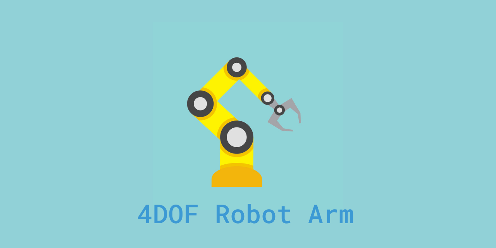
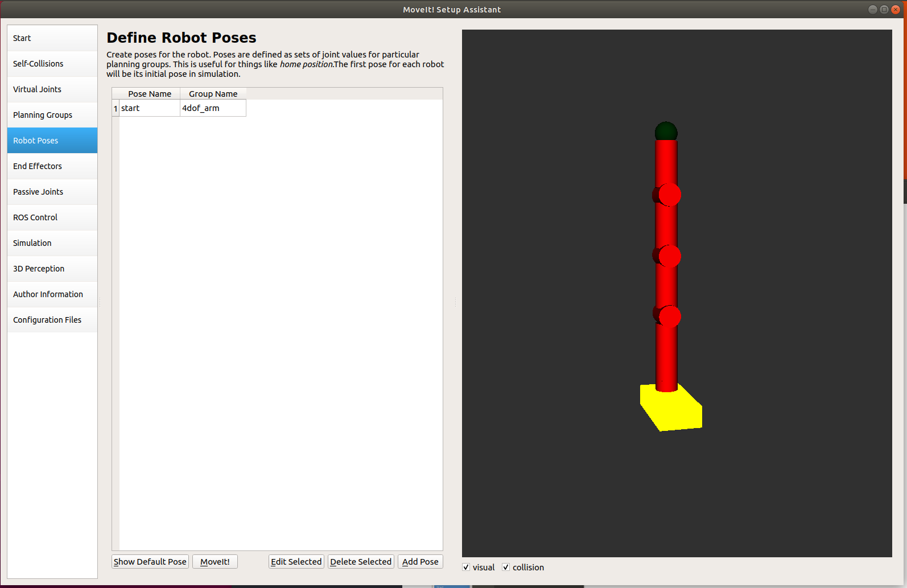
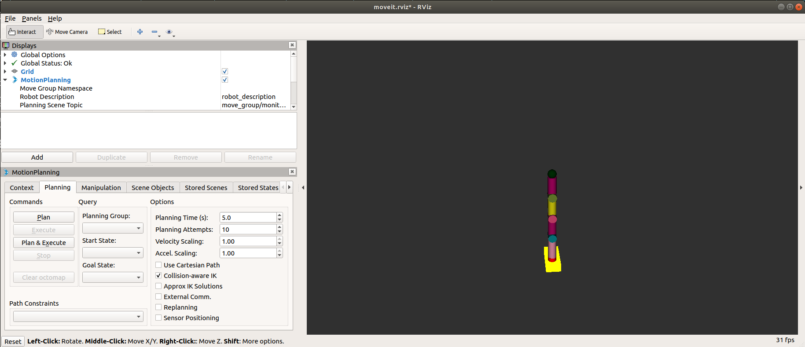
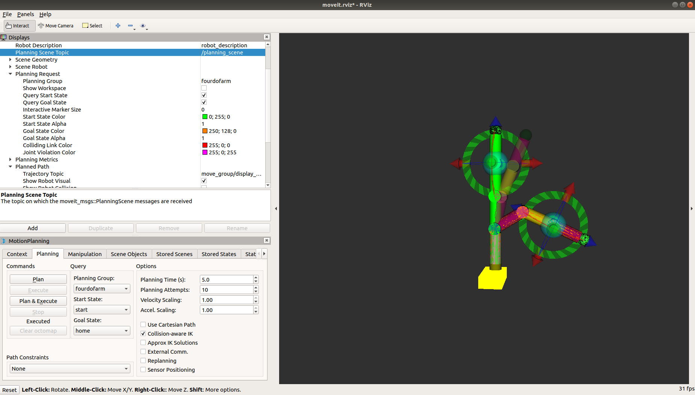
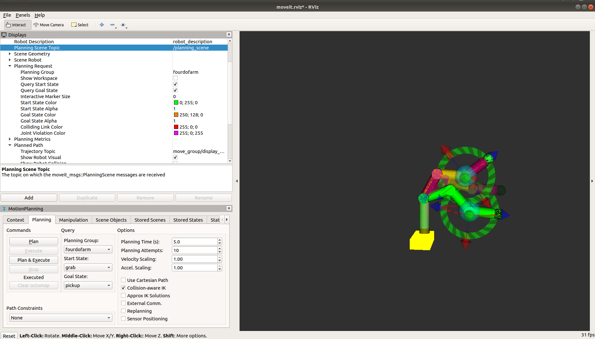
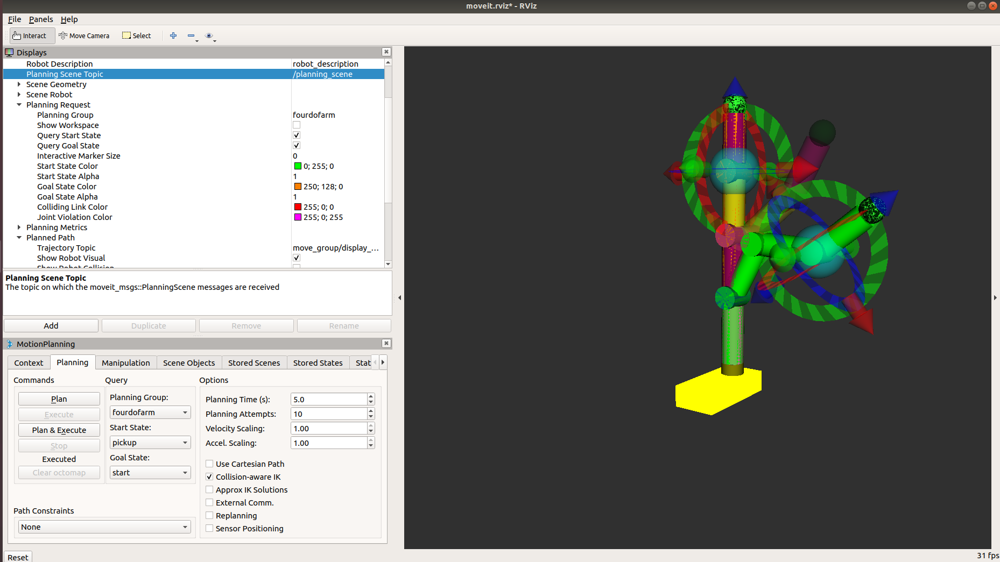

<a name="readme-top"></a>


<!-- PROJECT LOGO -->
<br />
<div align="center">
    


</div>


<!-- TABLE OF CONTENTS -->
<details>
  <summary>Table of Contents</summary>
  <ol>
    <li>
      <a href="#about-the-project">About The Project</a>
      <ul>
        <li><a href="#built-with">Built With</a></li>
      </ul>
    </li>
    <li>
      <a href="#getting-started">Getting Started</a>
      <ul>
        <li><a href="#prerequisites">Prerequisites</a></li>
        <li><a href="#installation">Installation</a></li>
      </ul>
    </li>
    <li><a href="#usage">Usage</a></li>
    <li><a href="#roadmap">Roadmap</a></li>
    <li><a href="#license">License</a></li>
    <li><a href="#contact">Contact</a></li>
    <li><a href="#acknowledgments">Acknowledgments</a></li>
  </ol>
</details>


<!-- ABOUT THE PROJECT -->
## About The Project

Implement computer vision: You could add a camera or depth sensor to your robot arm and use computer vision techniques to detect and track objects in the environment. This would allow your robot arm to perform more complex tasks, such as picking and placing objects in specific locations.
Add more degrees of freedom: A 4DOF robot arm is a good starting point, but you could add more degrees of freedom to make the arm more versatile and flexible. This would allow the arm to reach and manipulate objects from different angles and orientations.
Create a user interface: You could develop a graphical user interface (GUI) or command-line interface (CLI) to control your robot arm. This would make it easier for users to interact with the arm and perform tasks without needing to understand the underlying code or algorithms.
Use machine learning: You could use machine learning techniques to train your robot arm to perform specific tasks, such as object recognition or path planning. This would enable your arm to learn and adapt to new situations, making it more useful in a variety of contexts.
README:

The 4DOF robot arm is a project designed to create a robotic arm capable of moving in four different directions. Using the ROS Melodic framework and the MoveIt1 path planning library, this arm is capable of executing complex motion paths and avoiding obstacles and collisions. Further development of the project could include implementing computer vision, adding more degrees of freedom, creating a user interface, or using machine learning techniques.

<p align="right">(<a href="#readme-top">back to top</a>)</p>

### Diagram of the 4DOF robot arm


### Screenshot







### Built With
   
* 
* 
* 
* 


<p align="right">(<a href="#readme-top">back to top</a>)</p>


<!-- GETTING STARTED -->
<!-- ## Getting Started

This is an example of how you may give instructions on setting up your project locally.
To get a local copy up and running follow these simple example steps.

### Prerequisites

This is an example of how to list things you need to use the software and how to install them.
* npm
  ```sh
  npm install npm@latest -g
  ```

### Installation


1. Get a free API Key at [https://example.com](https://example.com)
2. Clone the repo
   ```sh
   git clone https://github.com/your_username_/Project-Name.git
   ```
3. Install NPM packages
   ```sh
   npm install
   ```
4. Enter your API in `config.js`
   ```js
   const API_KEY = 'ENTER YOUR API';
   ```

<p align="right">(<a href="#readme-top">back to top</a>)</p> -->


<!-- USAGE EXAMPLES -->
<!-- ## Usage


For more examples, please refer to the [Documentation](https://github.com/pangineering/4dof_robot_arm/wiki)_

<p align="right">(<a href="#readme-top">back to top</a>)</p> -->


<!-- ROADMAP -->
## Roadmap

- [x] Create a simple robot arm model
- [x] Add Joint publisher packages to the workspace
- [x] Install Moveit
- [x] Create a package with Moveit
- [ ] Create robot worlds:
    - [ ] Stacking can
    - [ ] Stacking block
    - [ ] Factory
- [ ] Add an industrial robot arm
- [ ] Implement computer vision
  - [ ] Add a camera or depth sensor
  - [ ] Implement object detection algorithm
- [ ] Create a user interface
  - [ ] Choose a programming language and framework
  - [ ] Design user interface layout
- [ ] Use machine learning
  - [ ] Collect and label training data
  - [ ] Choose appropriate machine learning algorithm
  - [ ] Implement and train the algorithm


See the [open issues](https://github.com/othneildrew/Best-README-Template/issues) for a full list of proposed features (and known issues).

<p align="right">(<a href="#readme-top">back to top</a>)</p>


<!-- LICENSE -->
## License

Distributed under the MIT License. See `LICENSE.txt` for more information.

<p align="right">(<a href="#readme-top">back to top</a>)</p>


<!-- CONTACT -->
## Contact

Your Name - [@your_twitter](https://twitter.com/your_username) - email@example.com

Project Link: [https://github.com/your_username/repo_name](https://github.com/your_username/repo_name)

<p align="right">(<a href="#readme-top">back to top</a>)</p>

## Support

### 💰You can help me by Donating
[](https://buymeacoffee.com/pangineering)  
 
[](https://ko-fi.com/pangineering) 


<p align="right">(<a href="#readme-top">back to top</a>)</p>
