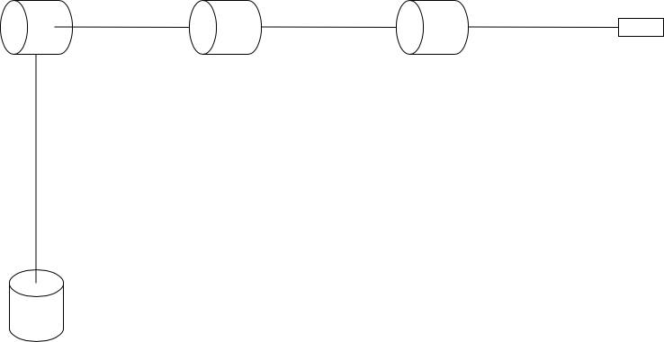

# 4DOF Robot Arm
ROS for 4-dof robot arm simulation

## Tech Stack
   

## Diagram of the 4DOF robot arm

## Installation

## Features

## Roadmap

---

## Support

### 💰You can help me by Donating
  
 
 
